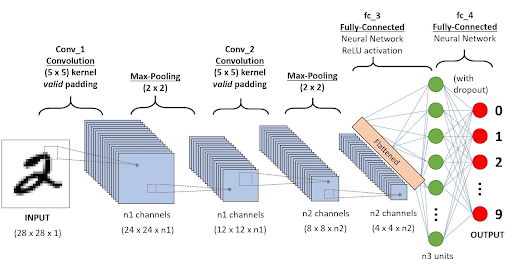
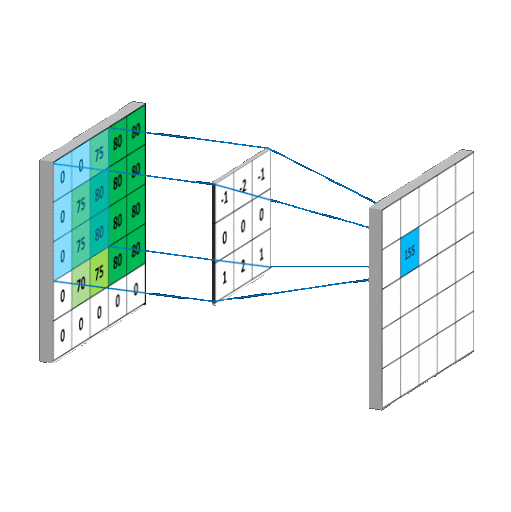
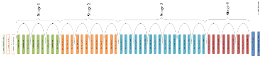
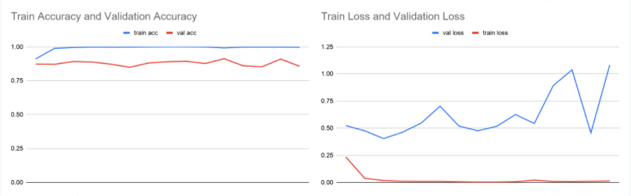
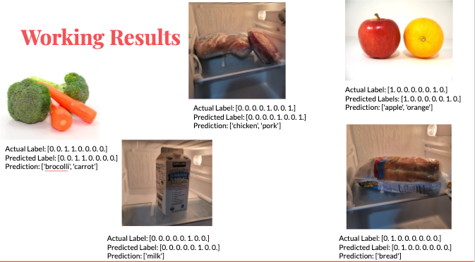
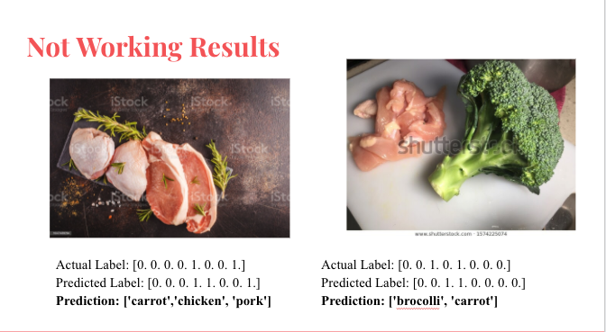
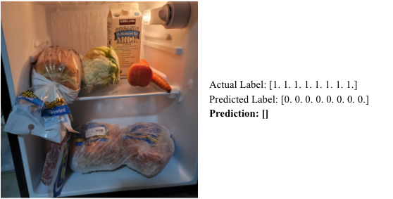
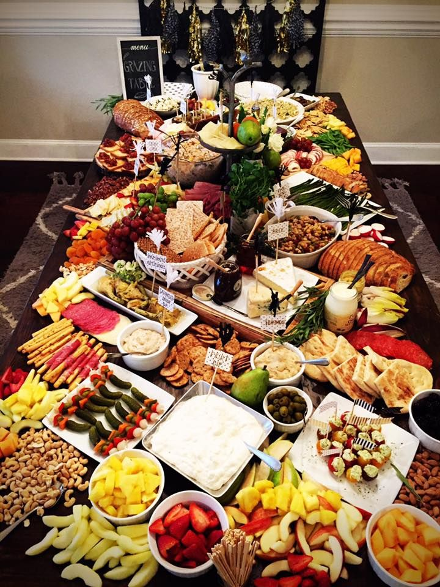

## Honey! What's in the fridge?

What if there was an easier way to know what’s in your fridge?

The main focus of our project was to create a machine learning model with multi-label classification that could recognize everything in our fridge with just a picture. 

Obviously, this sort of idea is useless on its own, but the possible implementations could be hugely advantageous. Given just a weeks time, we just wanted to create the basis for such a project, which is the multi label classification. We trained chicken breasts, raw pork, milk, oranges, apples, bread, carrots, and broccoli.

*Image of fridge with the 8 ingredients we wanted to train*

Below is our report in which we discuss how we trained and tested this model. In addition to this webpage, all the code we used will either be uploaded to the repository linked at the top or a link to that code will be mentioned at the bottom of this page.

### What Is Multi Label Classification?

To understand multi label classification, first we have to understand multi class classification as multi label is just an extension of multi label. Multi class classification is when you train a model to detect many different classes but only one at a time in the image. This is a categorical problem because it is only deciding which of the categories has the highest probability of being in the image. The output of a multi class classification model would only be one label. However, for multilabel classification, you train a model to detect many different classes but it can also detect many of them in the same image. It can assign many classification labels to one image. Multilabel classification is a binary problem because it is deciding, is this class in the picture, is the next one in the picture and so on. The number of outputs for multilabel classification is as many classes that you are training, in our case there are 8.

*Visual representation of multi-label classification*

### Overview of our Method:

1. We started by getting a list of the items we thought would be in the average fridge. We selected a small list of 8 ingredients, chicken breast, raw pork, milk, oranges, apples, bread, carrots, and broccoli. 

2. We had to preprocess our images so we could input them into our model. We also used data augmentation on our images, by flipping and rotating them, to create a larger dataset for our model to be trained.

3. We then coded our model and modified it so that it supports multilabel classification. We used transfer learning to fit the model better to our specific dataset.

4. Finally after training, we saved our model and tested it on images taken from our fridges.

### Data Collection and Preprocessing

For data collection, we used an image scraper to download 100 images of each of our ingredients. Since we had little time and we wanted to train a shorter model, we decided to make the model simpler by grouping some ingredients like apples and oranges into categories like fruit. Then we had to resize the input pictures to a supported size, 224x224 and we had to change all the file extensions to .jpg and change the names so they were easier to read. We wrote a python script that did this for us which is included in our repository. Next, we had to create a .csv file with the true labels if each category that we had, for example the fruits category had pictures of apples and oranges, so we would put a 1 under the labels apples and oranges and a 0 everywhere else. Our csv file is a combination of single and double label classes to test that our model can output multiple labels at once. Finally, we performed data augmentation to increase our data from 100 to 250 images and to increase variability in images by using random rotations, zooming, etc.  

*The CSV file we used*

### What Type of Neural Network Did We Use?

We used a CNN to make our model.CNN or Convolutional Neural Networks are a multi dimensional extension of Neural Networks. They extract features, which are low dimensional, data from the images. A CNN utilizes the kernel or a filter to perform multiplication and summation on a larger matrix. Kernels shift incrementally along all axes of the matrix to compose a new output matrix composed of the values of the operation. CNNS are primarily used for image based tasks such as recognition or classification

*Visual representations of CNN models*

### How Did We Make Our Model?

We decided to use the ResNet50 model because we needed a comprehensive model unlike shorter models like vgg16 and ResNet has very good object recognition. You can see a model layout of ResNet below. We removed the last layer from the model to add our own so that we can change the number of outputs to make the model a multilabel classifier. We added both a final dense layer and an output layer using sigmoid activation with 8 outputs. Sigmoid activation makes each output a probability between 0 and 1 for each label allowing our model to decide if each ingredient is a 1 or 0 (in the image or not). Finally, we applied transfer learning when training our model.

Transfer learning is a method used to retrain your model on the pretrained weights. Using this method improves accuracy in some cases and decreases training time. Another feature on transfer learning is the ability to unfreeze some layers so that the learned weights in those layers can be retrained on your own data, this is helpful when the accuracy is lower than the targeted accuracy. We kept most of the layers frozen because the object detection of the pretrained model is really good, and we wanted to preserve that. We unfroze the last few layers because we felt that the pretrained models weights in the last few layers were overgeneralizing causing our testing predictions to be wrong. This increased our accuracy and improved test results by a lot.

*model layout of ResNet*

### What are our Results?

Our first result is the pretrained model itself as well as the accuracy and loss values recorded which are depicted below. The accuracy goes up while the loss goes down as expected, but the values are unusually high for accuracy and low for loss.

Our other results included our test images and our examples are shown below. There were three things we tested for when testing our model…
1. Single label images - Did our model recognize images containing one label 
2. Double label images - DId or models recognize images we trained with two ingredients 
3. More than two label images - Is our model able to recognize the ingredients in a combination it was not trained with, we looked for more than two labels since    we showed the model an image with more than two ingredients
Both single and double image tests were just to make sure that our model’s training was successful.

Below are our single and double image tests that correctly predicted what was shown in the image. The reason for the specific combination of ingredients is due to how our .csv file was structured which paired those ingredients together.

Below are some of the images that did not work and created unexpected results and show what went wrong with our model.

The first image depicts only chicken breast and raw pork but our model added the label carrot as well. We assume it did this because of the green herbs and the orange spices in the image. Although the image did not contain carrots, this result showed us it was possible for our model to output more than two labels and output them in a way the model was not trained on.

The second image depicts chicken breast and broccoli but our model predicted that broccoli and carrots were in the image. We suspect this had something to do with how the image identified broccoli over chicken breast and then assumed since broccoli is in the image, carrots must be too.

The third image is our strangest result as our model predicted that an image with all of our ingredients contained none of those ingredients. Although with our previous result we know the model can output more than one label and recognizes all of our ingredients separately well, it cannot recognize any in this image.

### What Does This Mean?

The results from the broccoli, chicken, and pork images shows that our model is built correctly, it is able to output three labels without being trained on images corresponding to those labels. So the model itself is capable of multi-label classification
The results of the broccoli and chicken image shows what went wrong with our model, the data set, since we trained broccoli and carrots together it recognized broccoli and assumed carrots would be in there too. The error in our data set can be seen with the fridge image as well. Since the model had no predictions we know it did not recognize any ingredient, although it has been able to before, this along with the fact we have a very high training accuracy and a very low loss,  leads us to believe that the model is overfitting. Since no ingredient matched the ingredients in the data close enough, the model gives no prediction
One other important thing to note is the size of an object, in our data set our ingredients are the only thing in the pictures. So relative to the size of the image it is fairly large, while with the fridge image they are way smaller. We know the model has the ability to recognize broccoli alone as seen in the broccoli and chicken image but the same can be said about chicken. So why did the model predict broccoli with a higher probability? We assume it is because in that image, broccoli is the larger object and as a result of overiffing, the model assumes carrots must be the second object.

### Future Work and Improvements

We want to create a larger database of the 8 ingredients we have now to address our overfitting and create a more accurate model. We would also want to train a lot more ingredients, so that our model can detect many more different types of foods. We would also like to create our own model from scratch. This could be beneficial for accuracy, as we feel the weights are way too generalized for the pretrained model we used. We would like to improve the model to be able to classify foods from videos, this one wouldn't be too hard to implement, we just need more time. One real world implementation of our model could be an app on your phone that automatically updates a list of items in your fridge by using an in fridge camera.

### Acknowledgements and References

The image scraper we used to collect images for our data set is located at this link :
https://github.com/ultralytics/google-images-download
We used a python library called Augmentor as well as a code uploaded on the repository to conduct our data augmentation
We used a python script code to process all of our images and resize and name them which is also included on the repository
To construct our model, we imported a Keras library and the ResNet50 model from that library
Our dataset and our final trained model are located in this google drive: https://drive.google.com/drive/folders/1cCY2tgEeiMrYNJjpu8WALDqKy0FRomyY?usp=sharing
