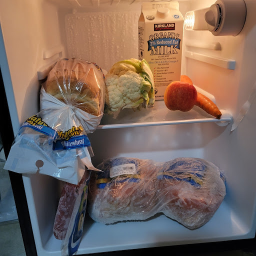
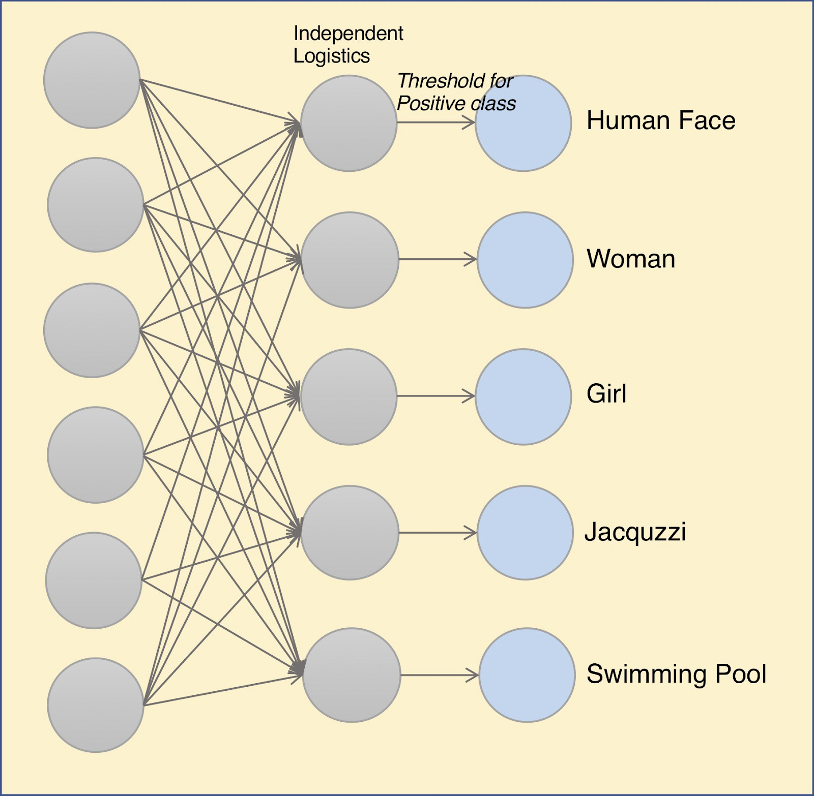
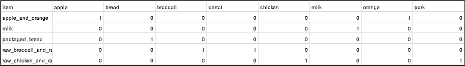

## Honey! What's in the fridge?

What if there was an easier way to know what’s in your fridge?

The main focus of our project was to create a machine learning model with multi-label classification that could recognize everything in our fridge with just a picture. 

Obviously, this sort of idea is useless on its own, but the possible implementations could be hugely advantageous. Given just a weeks time, we just wanted to create the basis for such a project, which is the multi label classification. We trained chicken breasts, raw pork, milk, oranges, apples, bread, carrots, and broccoli.

*Image of fridge with the 8 ingredients we wanted to train*

Below is our report in which we discuss how we trained and tested this model. In addition to this webpage, all the code we used will either be uploaded to the repository linked at the top or a link to that code will be mentioned at the bottom of this page.

### What Is Multi Label Classification?

To understand multi label classification, first we have to understand multi class classification as multi label is just an extension of multi label. Multi class classification is when you train a model to detect many different classes but only one at a time in the image. This is a categorical problem because it is only deciding which of the categories has the highest probability of being in the image. The output of a multi class classification model would only be one label. However, for multilabel classification, you train a model to detect many different classes but it can also detect many of them in the same image. It can assign many classification labels to one image. Multilabel classification is a binary problem because it is deciding, is this class in the picture, is the next one in the picture and so on. The number of outputs for multilabel classification is as many classes that you are training, in our case there are 8.

*Visual representation of multi-label classification*

### Overview of our Method:

1. We started by getting a list of the items we thought would be in the average fridge. We selected a small list of 8 ingredients, chicken breast, raw pork, milk, oranges, apples, bread, carrots, and broccoli. 

2. We had to preprocess our images so we could input them into our model. We also used data augmentation on our images, by flipping and rotating them, to create a larger dataset for our model to be trained.

3. We then coded our model and modified it so that it supports multilabel classification. We used transfer learning to fit the model better to our specific dataset.

4. Finally after training, we saved our model and tested it on images taken from our fridges.

### Data Collection and Preprocessing

For data collection, we used an image scraper to download 100 images of each of our ingredients. Since we had little time and we wanted to train a shorter model, we decided to make the model simpler by grouping some ingredients like apples and oranges into categories like fruit. Then we had to resize the input pictures to a supported size, 224x224 and we had to change all the file extensions to .jpg and change the names so they were easier to read. We wrote a python script that did this for us which is included in our repository. Next, we had to create a .csv file with the true labels if each category that we had, for example the fruits category had pictures of apples and oranges, so we would put a 1 under the labels apples and oranges and a 0 everywhere else. We had to make this .csv file by hand. Finally, we performed data augmentation to increase our data from 100 to 250 images and to increase variability in images by using random rotations, zooming, etc.

*The CSV file we used*
